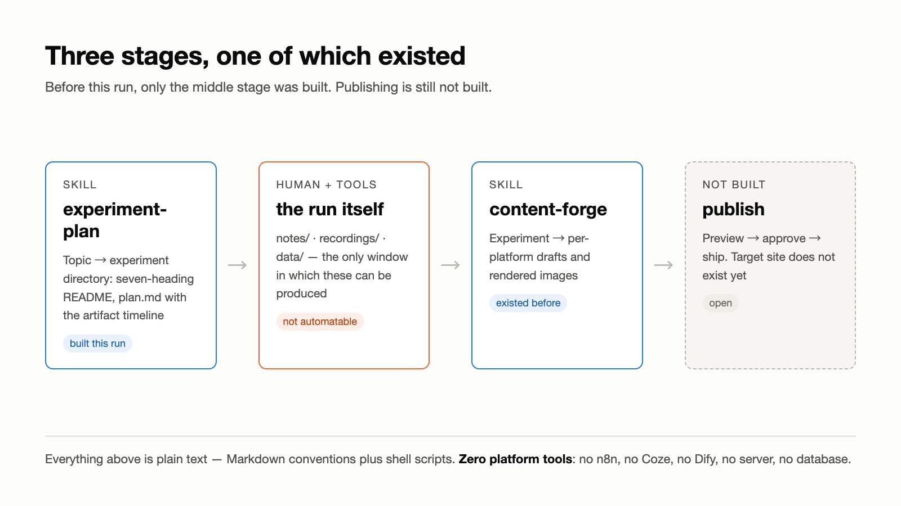
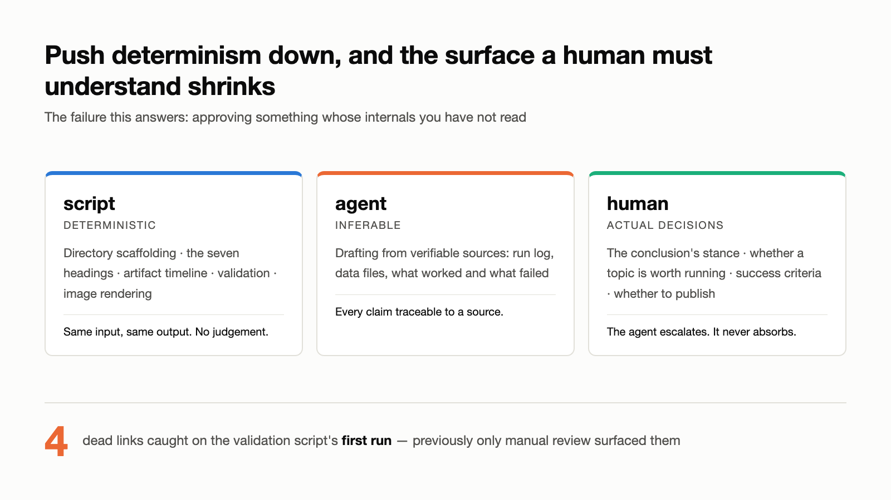

A thousand saved articles buy nothing you could call growth. Growth happens when you finish one thing, not when you read the thousand and first.

So I used an agent to build a content pipeline, then used the pipeline to record the experiment itself. The skeleton took half a day. The first draft took more than a week.

The week was not a coding outage. An agent is fast, but an ordinary prompt buys an ordinary result, and mediocrity is not a property of the model. It is the default: with no explicit constraint, generation returns to the mean, and the mean is mediocre. Getting above it means writing down what you do not want and why, item by item, and only a human can do that.

The system does not remove the human. It moves the human out of the deterministic work, and the judgment left over is exactly the part a thousand bookmarks cannot buy.

What follows is what actually happened during that week.

## The starting condition

My own, and I suspect it is not just mine: the bookmarks pile up, you have opinions worth writing down, and you publish nothing. Tools get compared. Approaches get researched. Best practices get collected. Nothing ships.

The fix I settled on was a container: treat every idea worth trying as an *experiment*, one directory, one record, one public write-up. And the first experiment was to build the recording machinery itself, using an agent.

The draft looked complete, but felt empty; each rewrite made me more reluctant to publish. I was close to reproducing the problem this system was meant to solve: researching and refining instead of shipping.

## The question

Can a content pipeline run on nothing but Markdown conventions and Claude Code skills, with no n8n, no Coze, no Dify, no server, no database?

The answer to that narrow question is yes, and it is the least interesting result here.

## Setup

Two repositories, both plain text end to end:

| Repo | Role |
| --- | --- |
| `silicon-leap-forge` | the pipeline: skills, platform configs, templates, conventions |
| `silicon-leap-lab` | experiment records; both input and output live here |

Two skills: `experiment-plan` turns a one-line topic into a runnable experiment directory; `content-forge` turns a finished experiment into per-platform drafts. Here, an agent is the Claude Code workflow that assists with drafting and deterministic steps; fact confirmation and publishing decisions stay with the author. Environment: macOS, Claude Code CLI, git. Nothing else installed for this.

*The pipeline before and after this run. Only the middle stage existed; publishing is still open.*

## What complete looks like when it is empty

The generated skill had frontmatter, a numbered flow, a hard-constraints list, and an acceptance checklist. Approving it took one sentence.

Running it produced the failure. The Xiaohongshu draft was unreadable. Not wrong, just dead. Tracing it back, the template hardcoded a three-part list skeleton: *Results / What worked / What went wrong*.

In a different file of the same configuration (`platforms/xiaohongshu.md`) sat this line:

> States the facts, then falls into a list. No situation, no reaction, numbers with no reference point.

The config was criticizing the template. The template was violating the config. **Read separately, both files were correct.** The contradiction only existed in the output.

The visual-assets section had the same shape of defect. It specified "emit SVG source, rendered by the author." This machine has no `rsvg-convert`, no ImageMagick, no `wkhtmltoimage`. The rule was unexecutable from the day it was written.

## What this run can and cannot explain

This is a single run, not evidence that every model or every draft behaves the same way. It does show two concrete failures: the generator did not surface a contradiction between two local files, and it did not decide whether the resulting text was worth publishing.

The useful change is therefore operational, not a claim about model limits: put the editorial standard in the workflow. A draft is evidence for review, not a finished article. Rewriting a draft fixes one document; a traceable review gate can improve the next run too.

## What that looked like in practice

- A seven-item anti-AI-tone list: canned section headings, benefit lists, buzzwords, "first/second/finally" scaffolding, degree words with no data behind them, universal sign-offs.
- A required narrative arc (shared situation → what was done → what it hit → what was learned) added to the distillation step, so a record with only the middle beat is caught as a log dump.
- The Xiaohongshu template rewritten from a list skeleton back into narrative structure.
- Determinism pushed down into shell scripts: directory scaffolding, validation, image rendering.
- A maximum of three independent review-and-revision rounds per batch. Reviewers score factual traceability, conclusion support, logic, readability, platform fit, and the disclosed human work; a draft that misses the gate is marked not publish-ready. Three is the ceiling for wording work: overturning a fact, a title, or the structure starts a new batch and resets the count, which is why this piece went through six.

*Determinism belongs in scripts. What remains is what a human actually has to decide.*

That last one is the durable part. A validation script now checks the deterministic invariants: heading text matches the parser interface verbatim, no empty cells in the step table, every relative link in `drafts/` resolves. Its first run caught four dead links that had previously only surfaced through manual review.

Images follow the same principle: HTML source is committed and diffable, PNGs are build products rendered by headless Chrome. No additional install.

The output of that first run was not kept, and recapturing it would prove nothing: I never opened a terminal. The agent ran the commands, so the "terminal session" this kind of evidence assumes does not exist here. The real artifacts are the session log and the git history.

## Results

| Metric | Value | Source |
| --- | --- | --- |
| Pipeline stages covered before this run | 1 of 3 (middle only) | code review |
| Skill files | 12 | `find` count |
| Platform configs / templates | 5 / 7 | `platforms/`, `templates/` |
| Information leaks found | 2 (commit author, absolute-path symlink) | git history + symlink scan |
| Execution failures | 1 (`cp -R` nesting) | run log |
| Identity-isolation scenarios verified | 3 / 3 | `includeIf` test |
| Platform-tool dependencies | 0 | no n8n / Coze / Dify |
| From starting to being willing to publish | more than one week; exact hours not recorded | author supplement, 2026-08-15 |
| Screen recordings | 0 (process evidence came from the session log instead: 105 human turns) | `notes/session-timeline.md` |
| Video channel delivery | failed (a 4:24 cut exists; not publishable) | author judgment, 2026-08-20 |
| Wall-clock time, token usage | not recorded | see caveats |

## Caveats

This record is retroactive. `plan.md` was reconstructed after the run, so the "expected counterintuitive finding" section had to be replaced with actual findings. A prediction written after the fact is worth nothing.

No timing or token data was captured, and `--reset-author` overwrote the commit timestamps, so git history cannot substitute for it. There are no recordings: `asciinema` was never installed on this machine, and more fundamentally, the work happens as a conversation with an agent rather than as hand-typed commands, so there is no "human operating a terminal" to record. The real process record is the conversation, and it was recovered after the fact: 105 human turns, timestamped from 08-08 to 08-18.

The video channel failed outright. Script, title, and thumbnail plans all generate fine because they are plain text, and even the assembly worked: scenes as plain text, TTS narration, images laid out against the narration length, narration doubling as subtitles, which produced a 4 minute 24 second cut. It is not publishable. With zero recordings, every frame is a session-log card or a diagram, and none of it is footage of the thing actually happening. The plain-text approach held for the written channels and broke here. The bar is higher than it looked.

Zero platform-tool dependencies are not zero publishing cost. Account registration and maintenance, real screenshots, author sign-off, mobile preview, layout, publishing, and comment handling are all human work. None of those actions have been performed or verified by this content package.

## Summary

All three criteria held, none of them automatically. The front stage turns a one-line topic into a runnable experiment directory, the back stage produces genuinely different packages per platform, and platform-tool dependencies stayed at zero. Every judgment in between was mine: which gap was worth closing, why a draft read dead, which quote to keep, how far the conclusion could go.

Two things transfer beyond this topic. Comprehension cost does not disappear, it defers: the questions skipped at approval time come back with interest at use time. And pushing determinism into scripts shrinks the surface a human has to understand at all.

The platform configs do not: they are written against these specific channels, so a new channel means a rewrite.

Sample size is one. This run shows only that the generation did not surface a cross-file contradiction on its own and could not decide whether the text was worth publishing. It says nothing about models in general, and it does not imply that switching models is useless.

The next experiment starts with `plan.md` written up front, so there is a prediction to be wrong about.

As for me, the lesson is one line: do not demand perfection, do not settle for mediocrity. Demand perfection and you never publish; settle for mediocrity and nobody reads what you publish.

## Reproduce

Everything is plain text. Inspect the [experiment README](https://github.com/siliconleap/silicon-leap-lab/blob/master/experiments/2026-08-markdown-only-content-pipeline/README.md), [confirmed content brief](https://github.com/siliconleap/silicon-leap-lab/blob/master/experiments/2026-08-markdown-only-content-pipeline/content-brief.md), [artifacts](https://github.com/siliconleap/silicon-leap-lab/blob/master/experiments/2026-08-markdown-only-content-pipeline/README.md#artifacts), and [full experiment directory](https://github.com/siliconleap/silicon-leap-lab/tree/master/experiments/2026-08-markdown-only-content-pipeline).
