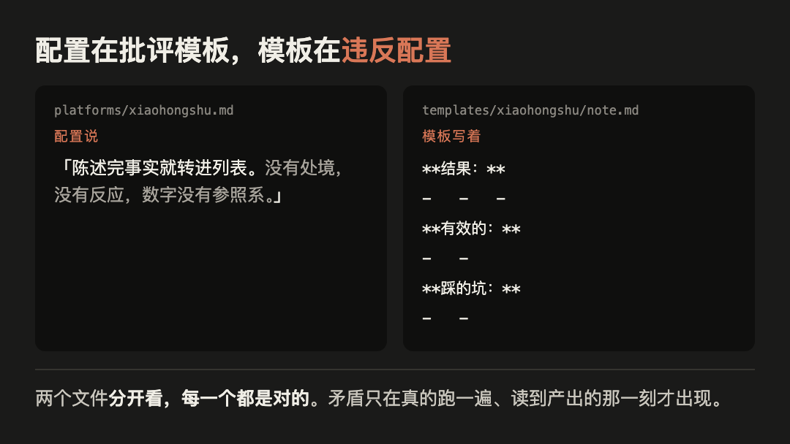
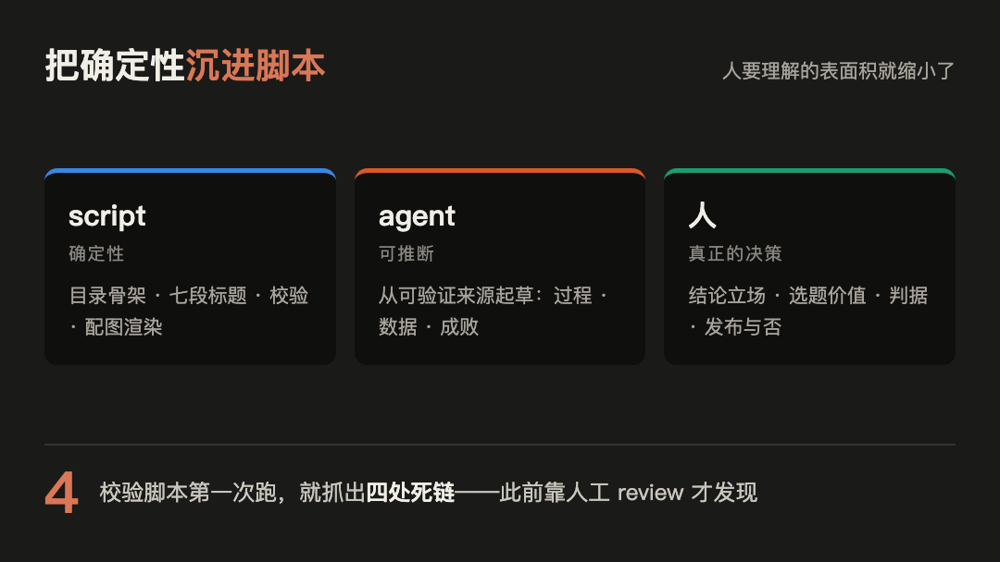

# 微信公众号草稿

## 标题

1000 篇文章收藏，换不来一次真正的成长

备选：

1. 收藏了一千篇，动手做了一件
2. 半天搭好流水线，第一篇却卡了一周多
3. AI 半天写完，我为什么一周多不敢发

## 摘要

收藏一千篇换不来一次成长。半天搭完内容流水线，第一篇内容却卡了一周多，拖住我的是事实核验、编辑判断和人工发布这几个只有人能做的环节。

## 正文

收藏夹里躺着一千篇「以后要做」，换不来一次真正的成长。成长发生在做完一件事的时候，不是读完第一千零一篇的时候。

这次我用 AI 搭了一条内容流水线，再用它记录这次实验本身。半天搭完骨架，第一篇内容却卡了一周多。

卡住的不是代码。AI 干活快，但普通的提示词只会换来平庸的结果——平庸不是模型的属性，是默认值：没有明确约束时，生成自然回归均值，而均值就是平庸。要拿到均值以上的东西，只能把「不要什么、为什么不要」逐条写进指令，这件事只有人能做。

这套东西不省人，它把人从确定性的活里换出来。剩下那些判断，正好是收藏一千篇换不来的部分。

下面是这一周多具体发生了什么。

### 起点：收藏很多，动手很少

第一篇小红书初稿看起来完整，读起来却没有一句让我想留下来。我越不满意，越继续改流程和文案，也越不肯开始发布。

后来才承认，这不是第一次这样。研究报告和前沿资讯读了很多，收藏夹里躺着一堆「以后要做」，也常常觉得某个方向值得做，但真正动手的尝试很少。回头看，这是一种眼高手低：输入越来越多，行动却没有形成闭环。

我怀疑这不只发生在 AI 领域，虽然这只是我的观察，没有数据。想学一门技能、做个项目、改掉一个习惯，大概也卡在这里：知道得更多，第一步却迟迟没有开始。

### 初稿为什么会读不下去

我往回翻，发现一组很荒唐的对照。

平台配置（`platforms/xiaohongshu.md`）写着：「陈述完事实就转进列表。没有处境，没有反应，数字没有参照系。」

模板却硬编码了「结果 / 有效的 / 踩的坑」三段列表。配置在批评模板，模板在执行被批评的写法。

*图 1：平台配置与旧模板的矛盾，来源为本次实验的两个文件。*

两个文件分开读都没问题，跑出一篇文案才看得出来：读者根本进不去。

### 这次能说明什么，不能说明什么

这是一次实验。它不能证明所有模型都会写得平淡，也不能推出换模型没有用。

它只证明了两件具体的事：这次生成没有发现两个本地文件互相矛盾；它也无法替我判断一篇文案是否值得发。

另一个失败来自配图规则。旧规则要求输出 SVG 后「由人渲染」，但机器上没有对应渲染器。规则写得完整，不代表流程能执行。

### 把编辑判断放进流程

这次动的是交付顺序，不只是模板。

跑到中段我在会话里写下这句：「生成了代码和 skill 之后，我压根没有理解内部的逻辑」（`notes/session-timeline.md`，2026-08-10 14:54:07，措辞经过整理）。批准得快，理解得慢，中间那段就是靠流程补的。

实验前先确认背景、读者、已知困难和叙事骨架。实验后不直接写长文，先写一份短内容简报：发生了什么、重要困难、作者观点、意外发现和结论边界。

作者确认简报后，才展开成不同平台的稿件。一批稿子最多经历三轮独立审核和修改：查事实是否可追溯，结论是否由证据支撑，逻辑是否顺，读起来是否像人话，图是否真的帮读者理解。三轮是表达层的上限；事实、标题或结构被推翻就算新一批、重新计轮，这篇到发出来一共跑了六轮。

换个说法，这是一套内容实验 harness：不是另一个模型或平台，而是把实验输入、约束、工具、人工确认和反馈串起来的运行环境。可推断、可重复的部分交给 AI agent，事实、结论和发布仍由作者自己确认。

仍不过线，就标成「不可发布」，不再用润色掩盖问题。

*图 2：脚本、agent 与人的职责边界，来源为本次实验产出的流程设计。*

### 自动化不等于没有人工成本

这次有 12 个 skill 文件，初始运行时 4 个平台配置和 6 个模板，补入微信公众号后是 5 / 7，平台工具依赖为 0，校验脚本首次运行抓到 4 处死链。

但「平台工具依赖为 0」不等于发布成本为 0。账号注册与维护、补真实截图、确认个人观点、手机预览、排版、发布和评论维护，都仍是人工动作。

视频尤其如此。组装那一段试通了：分镜写成纯文本，配音走 TTS，字幕直接用旁白，跑出过一版 4 分 24 秒的东西。但录屏为 0，画面只能拿会话记录卡和结构图凑，没有一帧是真实现场，这版发不出去。视频这个渠道，门槛比我想的高。

### 这次结论的边界

样本量为 1。能说的只有：这一次的生成没自己发现两个文件互相矛盾，也没替我判断一篇文案值不值得发。推不到所有模型，也推不出换模型没有用。

方法能带走多少也得算清楚。跨题目还成立的是两条：理解成本不会消失，只会后置，批准时省下的追问，用起来连本带利还回来；确定性沉进脚本之后，人要理解的表面积才会缩小。平台配置照着这几个渠道写死，换渠道等于重写。

两处硬缺口留着不粉饰：视频没做出能发的东西；耗时和 token 全程没记，「一周多」是回忆不是测量。

还有一处不算缺口：这次没有一张终端截图，也不该有。命令都是 agent 执行的，人从头到尾在对话框里，一手材料是会话记录和 git 历史，不是截图。

下一个实验带着 `plan.md` 先跑，不再事后补。

至于我自己，这次学到的是一句话：不苛求完美，不甘愿平庸。苛求完美就永远不发布，甘愿平庸就发了也没人看。

## 复现

完整记录、内容骨架、内容简报、skill、平台配置和配图 HTML 都在 `experiments/2026-08-markdown-only-content-pipeline/`。

## 配图清单

| # | 文件 | 内容 | 尺寸 | 来源 |
| --- | --- | --- | --- | --- |
| 封面 | `assets/00-cover.html` | 1000 篇收藏换不来一次成长；下方两张事实卡「半天：骨架搭完」「一周多：还是不想发」 | 900 × 500 | 生成 |
| 1 | `assets/01-contradiction.html` | 配置与旧模板矛盾 | 1080 × 608 | 生成 |
| 2 | `assets/02-layers.html` | 脚本、agent、人的职责边界 | 1080 × 608 | 生成 |

缺口：账号、发布和维护动作尚未执行，本稿不是已发布证明。（不列「缺终端截图」：命令由 agent 执行，这种工作方式下没有终端现场，一手证据是会话记录和 git 历史。）

## 发布备注

- 图片渲染：`scripts/render.sh drafts/wechat/assets`
- 已确认内容简报；已过六轮独立内容审核（`internal/review6.md`）；该轮开出的封面无源文案、配图清单错位、结尾复述正文均已修，修改后未再审。
- 图里的用户名、邮箱、绝对路径确认已脱敏。
