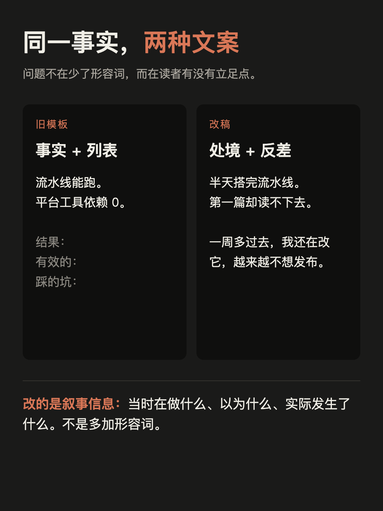

# 小红书图文草稿

## 标题

1000 篇文章收藏，换不来一次真正的成长

备选：

1. 收藏了一千篇，动手做了一件
2. AI 写完半天，我却一周多不敢发
3. 一篇 AI 初稿，暴露了我最怕的拖延
4. 别只让 AI 写初稿：我把审核上限设为三轮

## 正文

收藏夹里躺着一千篇「以后要做」，换不来一次真正的成长。

这次我用 AI 搭了一条内容流水线，半天搭完，第一篇内容却卡了一周多。

跑完之后有两个认知。

📌 一、AI 真能一次给几个平台写出风格不同的文案，也真能自动化，但没网上说的那么顺。模板、约束、审核，每一样都得自己搭自己修。跟 AI 许个愿，换不来一篇能发的文章。

📌 二、文案质量不该靠抽卡。同一个模型，你给什么约束它出什么水平。没有约束时它就回到均值，而均值就是平庸。

下面是具体过程。

🔍 骨架半天写完，读起来很像回事：分步流程、硬约束清单、验收标准都有。我批准它只花了一句话。

然后让它真跑一遍，第一篇小红书文案读起来很完整，没有一句让我想继续看。

往回翻才发现一个很荒唐的对照：配置文件写着「别陈述完事实就转进列表」，模板却要求「结果 / 有效的 / 踩的坑」三段列表。同一套东西，自己在反对自己。

*图 1：同一事实的两种写法。左侧是旧模板骨架，右侧是加入处境、反差和停顿后的改法。来源：本次实验的模板与修订规则。*

⚠️ 更麻烦的是我自己。初稿不满意，我就继续加规则、改流程，越改越不想发布，差点回到最初的状态：读得很多，想得很多，一篇没发。

🔁 后来改的不是文案，是顺序：先写一份短简报请自己确认事实和观点，再展开成各平台稿件，然后交给独立审核看事实、逻辑、边界和可读性。一批稿子最多改三轮，不过线就标「不可发布」，不用润色掩盖。改了事实或结构就重新计轮，这篇一共跑了六轮。

（这里说的 AI agent，就是帮我写初稿、跑固定检查的那套东西。事实和发不发，还是我定。）

📋 这次做的五件事，哪些能复制：

- 让 AI 搭流水线，一次产出多平台文案 —— 有效，能复制
- 用社区现成的 skill 提升文案质量 —— 有效，能复制
- 用流程约束替代反复抽卡 —— 有效，能复制
- 把确定性的活沉进脚本（校验、配图渲染）—— 有效，能复制
- 让 AI 反推图片合成视频 —— 目前无效，不能复制

最后一条是这份清单可信的原因。视频的组装其实通了，也跑出过一版 4 分 24 秒，但录屏为 0，画面全靠记录卡和结构图凑，发不出去。

💰 还有个常被省掉的事实：平台工具依赖可以是 0，人工成本不是。注册与维护账号、补真实截图、确认观点、手机预览、排版发布，都还得有人做。

📐 边界：样本只有这一次，别当成通用方法。这篇也没有一张终端截图，因为命令都是 agent 执行的，我全程在对话框里，一手材料是会话记录。

👉 完整实验记录和源文件放在评论区 / 主页。

## 标签

#AI编程 #ClaudeCode #AIAgent #内容创作 #独立开发 #AI工作流 #实验记录

## 配图清单

| # | 文件 | 内容 | 来源 |
| --- | --- | --- | --- |
| 封面 | `assets/00-cover.html` | 1000 篇收藏换不来一次成长 | 生成 |
| 1 | `assets/01-before-after.html` | 同一事实的旧稿 vs 改稿对比 | 生成 |
| 2 | `assets/02-contradiction.html` | 配置与模板互相矛盾 | 生成 |
| 3 | `assets/03-timeline.html` | 批准、生成、返工到拖延的时间线 | 生成 |
| 4 | `assets/04-layers.html` | 脚本、agent、人工审核的职责边界 | 生成 |

全部 1080 × 1440。每张图必须能脱离正文独立看懂。

缺口：

- 不补终端截图：命令由 agent 执行，这种工作方式下没有终端现场，一手证据是会话记录和 git 历史。
- 平台账号注册、认证、发布和维护尚未执行；本文是内容包，不是已发布证明。

## 发布备注

- 图片渲染：`scripts/render.sh drafts/xiaohongshu/assets`
- 发布前由作者确认：一周多的经历、结论、封面与图文顺序。
- 已过六轮独立内容审核，第 6 轮见 `internal/review6.md`；该轮开出的封面无源文案、标题措辞、结尾复述均已修，修改后未再审。
- 图里的用户名、邮箱、绝对路径确认已脱敏。
