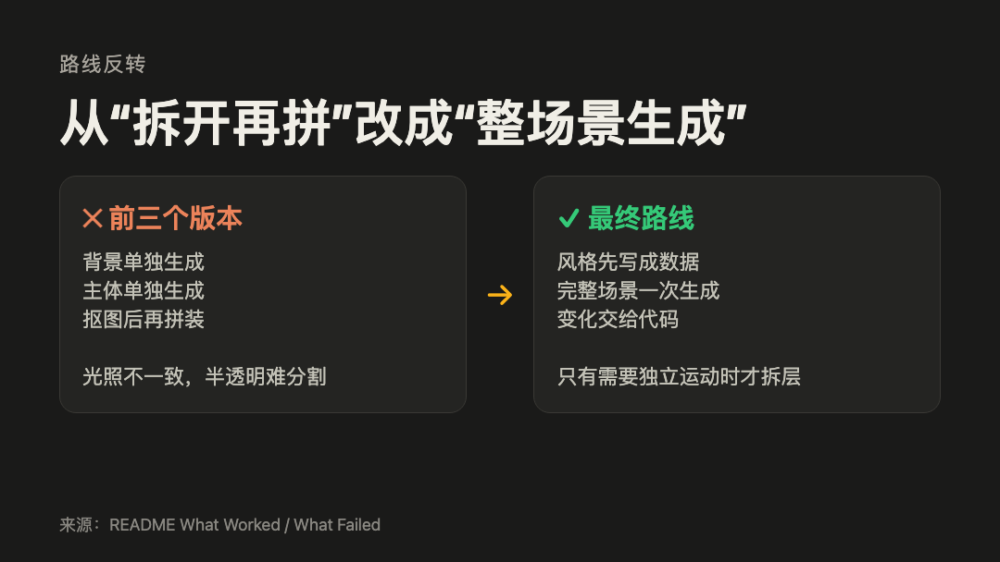
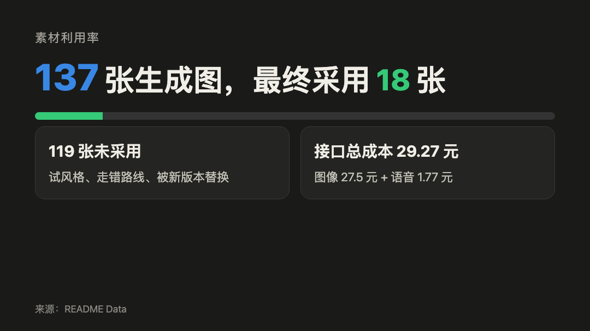
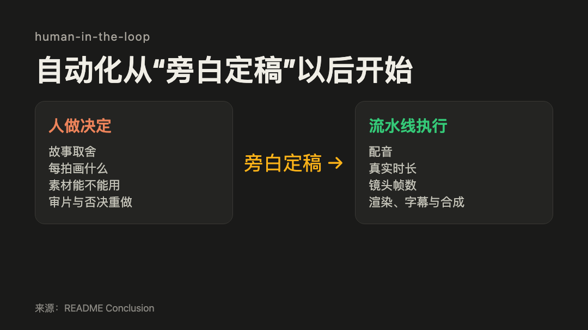

这次实验要补上一次内容流水线缺掉的一环：把一段文字故事做成插画动画。它面向的不是有现成素材的剪辑任务，而是没有分镜、实拍和插画时，手里的项目或故事能不能仍然被讲出来。

上一次，我已经能把一份跑完的实验记录整理成网站、GitHub、公众号、小红书和 YouTube 的内容包。唯独视频没有做成。那支 4 分 24 秒的旧片由截图、文字卡和旁白拼成，能播放，却像在念文章，所以没有发布。

这次我用同一套最终流程做了两支片子：Film A 是“AI 能否把实验记录做成多平台内容”那次软件实验的动画版，里面有截图和硬信息；Film B 是原创童话《最后一盏灯》，从文字开始，没有任何现成画面。结果是，两支片子都做出来了，但 Film A 即使通过技术检查，仍然被我推翻重做了三次。

**技术检查能确认视频存在，不能确认它讲清了故事。**

**旁白定稿后可以自动化，画面要讲什么仍要人决定。**

## 通过检查，却还没讲成故事

Film A 第一次通过检查时，我本来该收工了。它没有坏：186 秒，最长静止画面 4.67 秒，渲染和素材清单都没报错。可我看完后说不清它到底在讲什么。旁白在讲一次内容实验，画面却只是在转动齿轮和漂浮卡片。技术上它已经是一支视频，叙事上却还是一篇文章的配图。

## 三次重做，改的不是提示词

一开始我按最直觉的方式做：先生成背景、人物和道具，再把它们抠出来拼成镜头。它听起来很灵活，人物能单独移动，背景也能复用。

但三版之后，问题没有消失。背景和主体来自不同生成，光照和材质总是差一点，叠在一起像贴纸。半透明物体和浅色物体的边缘又抠不干净。每想增加一点变化，还要再生成一张图。改提示词、改遮罩、改坐标，都是在修一条已经走错的路。

*图 1：三次返工后，素材策略从“先拆再拼”改成“先生成完整场景，再按需补图层”。*

第四版把顺序倒了过来。先确定配色、材质、光照和运动习惯，再按叙事场景生成完整画面。画面里的位移、缩放、生长和滚动交给代码。只有某个对象确实需要独立运动，才额外生成背景透明、主体不透的图层，不从完整画面里硬抠边缘。

片 A 最后有 14 个镜头，却只用了 5 张生成图。它不再靠不断换图制造变化，而是让同一张图里的东西动起来。

## 通过 QA 以后，问题才露出来

两支片子都通过了基础交付检查：能正常渲染，画面不会连续静止超过 8 秒。Film A 最终 186.46 秒，Film B 76.60 秒。180 秒只是一个推荐长度，不是合格线。

这些检查只回答“片子有没有做出来”。它们没有拦住 Film A 的第一版，因为它漏掉了上一个实验最重要的内容：哪些做法有效，哪些做法无效。有一个镜头的截图和旁白甚至在讲两件不同的事。

我后来加了一条很笨、但有用的要求：每段旁白旁边必须写清这个镜头要给观众看什么。写不出来，就先别生成图。片 A 后来的重做，不是为了让图更精致，而是为了让画面终于能接住旁白。

*图 2：两支片子生成了 137 张图，最终只留下 18 张。被丢掉的多数不是坏图，而是不再服务故事的图。*

接口账单很小，图像和语音一共 29.27 元。真正贵的是试错。两支片子合计用了约 19 小时，里面包括一版作废的 Film B 和 Film A 的三轮重做。调研路线、补齐流水线、写和改旁白与分镜、生成并淘汰素材、渲染、审片，都算在里面。

记录里有 21 次失败，指生成、抠图、渲染或校验没有按预期完成。还有 37 次人工介入，里面有故事和视觉上的决定，也有能沉淀为规则的要求。数字并不说明人做得不够少，它说明最难的部分还没有被自动化。

## 自动化从决定之后开始

旁白一旦定下来，后面的链路反而很顺。先合成语音，量出每段的真实时长，再把它换算成镜头帧数。改一句旁白，Film A 的 14 个镜头会一起更新时长，不用手工对时间。

这就是文中说的“代码合成动画”：生成完画面后，代码负责它什么时候移动、放大或切换，不必为了每一个动作重新生成图片。

*图 3：旁白定稿后，配音、计时、渲染和合成可以串起来跑；故事取舍、镜头设计和审片仍要人做。*

作者给 Film B 的完成度和观感打了 3/5，半天做到当前版本。Film A 到 4/5，日历上跨了接近一周。这里的一周是反复打磨的跨度，不是额外 19 小时。那一分没有藏在任何 QA 指标里，只藏在一次次“这个镜头到底在说什么”的重做里。

## 这次留下的做法

| 实践 | 是否有效 | 是否可复制 |
| --- | --- | --- |
| 先生成完整场景，再按需补独立图层 | 有效 | 可复制为方法原则 |
| 一段旁白对应一个能说清的镜头 | 有效 | 可复制为方法原则 |
| 用真实配音回填镜头时长 | 有效 | 可复制为方法原则 |
| 先拆背景和主体，再依赖抠图拼装 | 在本次路线中无效 | 不建议复制 |

## 现在能带走什么

两支成片已经公开：Film A 和 Film B 的链接在文末。

上一次实验留下的 [`content-forge`](https://github.com/siliconleap/silicon-leap-lab/tree/master/.claude/skills/content-forge) 也已经在仓库里。它不制作动画，它做的是把完成的实验整理成网站、GitHub、公众号、小红书和 YouTube 的可审核草稿，并生成配图源文件和校验结果。事实确认、账号权限、最终排版和发布仍要人完成。

这次用于制作影片的 `editorial-video` 则还在改进。它把已经确认的旁白和场景计划做成有时间轴、由代码控制运动的镜头，但目前还不是一个可以直接安装、照着跑的公开成品。文中“可复制”的，是先定画面、让旁白和镜头一一对应、按真实配音回填时长、按需拆图层这些方法，不是一套现成的视频生产线。

这次只跑了两个线性故事，都不需要真人、实拍或复杂表演。它能说明 AI 可以把想清楚的故事做成低成本插画视频，不能说明它会自动替人想清楚故事，更不能代表所有视频都适合这条路。

---

完整记录：[实验目录](https://github.com/siliconleap/silicon-leap-lab/tree/master/experiments/2026-08-story-to-animated-video)
Film A：[YouTube](https://youtu.be/oOVnuUOSYBY)
Film B《最后一盏灯》：[YouTube](https://youtu.be/aUFPD-lNm3w)
