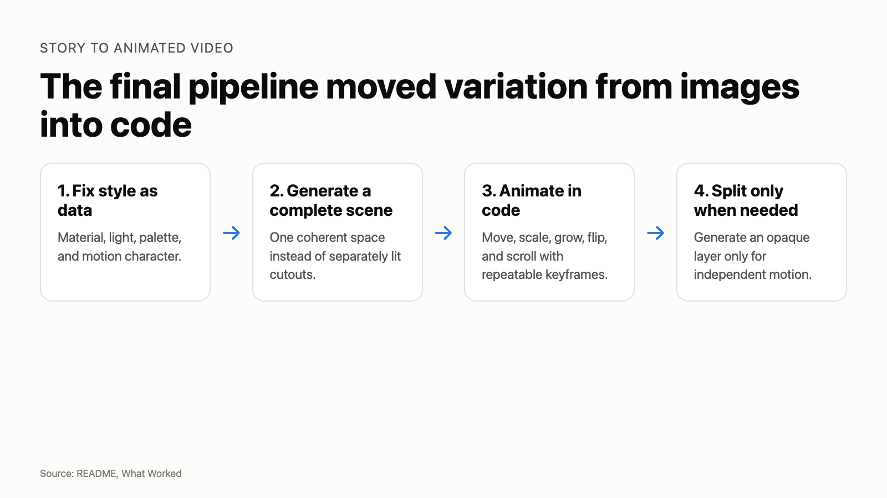
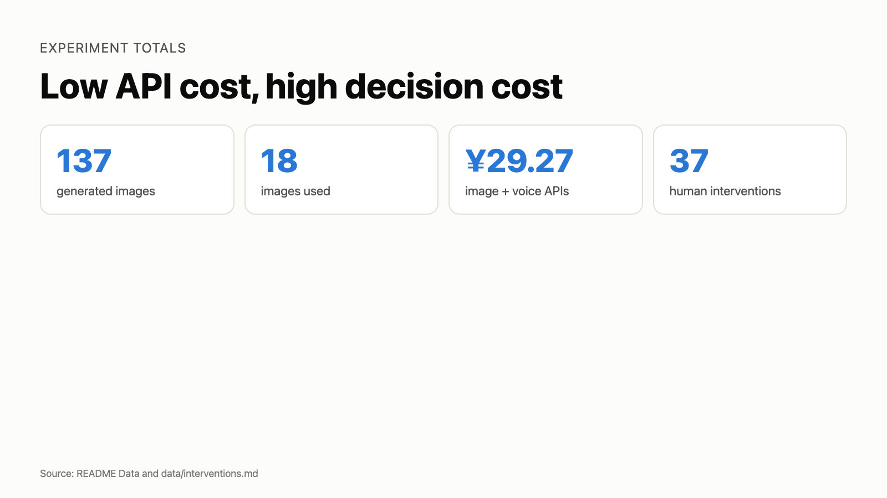
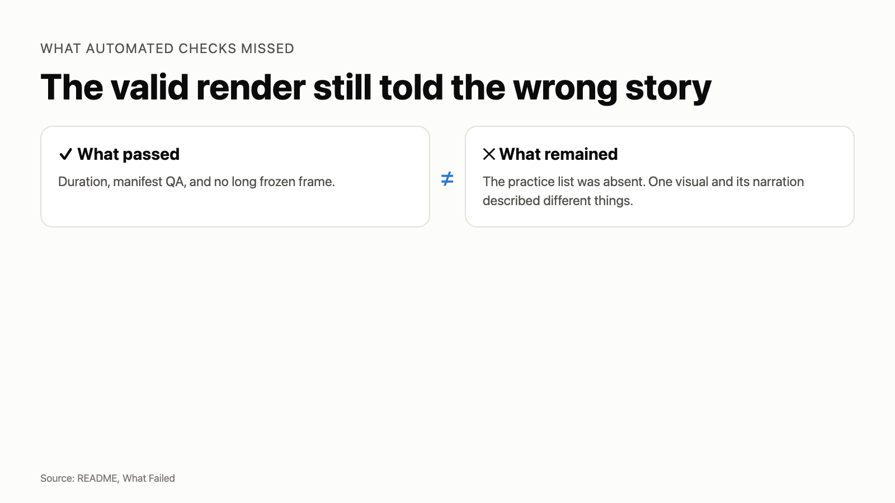

This experiment fills the missing step in a content pipeline: turning a written story into illustrated animation. The test was not about editing supplied footage. It asked whether a project or story could still be shown when there was no storyboard, footage, or prepared art.

The previous experiment could turn a completed experiment record into drafts for a site, GitHub, WeChat, Xiaohongshu, and YouTube. Video was the missing channel. Its last video was a 4 minute 24 second sequence of screenshots, cards, and narration. It played, but it read the article aloud, so I did not publish it.

This time I used one final approach to make two films. Film A is an animated account of the earlier experiment about turning completed experiment records into multi-platform content. Film B is the original fairy tale *The Last Light*, which began as text alone. Both films were completed. Film A still went through three rebuilds after it passed its technical checks.

This is for a specific situation, not a claim about everyone: someone has a project or a story worth showing, but no footage, illustration, or editing material. Here, **AI video generation** means generated illustrations assembled and animated in code, not a video-diffusion model. **Human-in-the-loop** means a person still chooses the story, visual direction, and whether a cut should be rejected.

## It passed the checks and still did not tell the story

Film A passed its first checks early. Nothing had obviously broken: it was 186 seconds long, its longest frozen stretch was 4.67 seconds, and the renderer found no QA failures. But when I watched it, I could not say what it was trying to show. The narration described an experiment; the pictures showed turning gears and floating cards. It was a video file, not yet a visual story.

## Three rebuilds changed the route, not the prompt

The first route was simple: **choose a topic → generate background and subject icons → split scenes → assemble a video**. It looked plausible, but three versions produced mismatched light, broken cutouts, and sticker-like composites. The route that finally worked was: **choose a topic → split it into narrative scenes → give each narration segment a picture → fix a visual style → generate complete scenes → add an independent layer only when something must move separately → animate in code → derive timing from the finished narration → assemble and run QA**.

The renderer behind that second route is called `editorial-video`. It turns an approved script and scene plan into shots where code controls when elements move, scale, or change. It is still a work-in-progress production toolchain, not a product this article asks readers to install. A complete scene is its default because it keeps light and materials coherent; a separate transparent-background layer is added only for independent motion. That distinction came directly from the failed first route.

The run took about 19 hours across both films, including a discarded Film B and three Film A rebuilds. That is not 19 hours of rendering. It includes comparing approaches, adapting the pipeline, revising narration and scene beats, generating and rejecting images, rendering, and review. The final API bill was CNY 29.27. The longer cost was deciding what a shot should show and rejecting work that was technically valid but wrong.

*Figure 1. The final pipeline used complete generated scenes and code-controlled movement. Source: this experiment's README and artifacts.*

## The question

The previous experiment had already tried to turn text into video. It produced a 4 minute 24 second sequence of screenshots and static cards. The file existed, but the result did not qualify as animation or as something I wanted to publish.

The test used the same final pipeline for both inputs so it would not merely prove that existing screenshots can carry a software story.

## Setup

| | |
| --- | --- |
| Tools | macOS, Claude Code CLI, Opus 5, Node.js 24.6.0, Tencent image generation, Tencent TTS |
| Tasks | Research approaches, adapt one pipeline, write narration, generate assets, render, review, revise, run QA |
| Duration | About 19 hours across the full experiment |
| Format | 1920×1080, TTS narration, no presenter or live footage |

The run first compared stock-footage assemblers, video diffusion projects, and code-based animation. Code composition fit the test because it made movement repeatable and measurable. Both final films used the same illustrated-video pipeline. Film A briefly used a browser-based frame renderer while I rebuilt its visual direction.

In this run, **code-generated animation** means that keyframes calculate visual change after a scene is generated, instead of asking a new image to supply every movement.

## What is available now

The first experiment's [`content-forge` package](https://github.com/siliconleap/silicon-leap-lab/tree/master/.claude/skills/content-forge) is available in this repository for people who want to adapt it. It takes a completed experiment directory and produces reviewable, platform-specific drafts for a site, GitHub, WeChat, Xiaohongshu, and YouTube, including visual source files and validation steps. It does not publish for you: factual confirmation, account access, final layout, and the publishing decision remain human work.

The two finished films are public now. Film A and Film B can be watched through the links at the end of this article.

`editorial-video` is different. It was the evolving production toolchain tested here, and it is not yet offered as a public, ready-to-use package. The experiment improved it, but its installation path, supported use cases, and release boundary still need work. The transferable practices in this article are principles readers can adapt in their own tools, not a downloadable, finished video-production system. Readers can take the findings and the published films from this experiment; they should not treat the renderer as a finished public workflow yet.

## Results

| Metric | Film A | Film B |
| --- | ---: | ---: |
| Final duration | 186.46 s | 76.60 s |
| Longest frozen frame | 4.67 s | 4.00 s |
| QA failures | 0 | 0 |
| Generated images used | 5 | 13 |
| Author score | 4/5 | 3/5 |
| Time to current version | Nearly one week | Half a day |

Across both films, the image service generated 137 images. Only 18 reached the final cuts. Image generation cost CNY 27.50, voice generation cost CNY 1.77, and total API cost was CNY 29.27. The run recorded 21 failures and 37 human interventions: 25 decisions, 10 actions that could become rules, and 2 manual rework actions. Token use was not recorded.

*Figure 2. Generated images, retained images, API cost, and human interventions. Source: README Data and data/interventions.md.*

These figures show that the pipeline can produce both films at low API cost and that most generation work was discarded. They do not measure visual quality. Film A passed the duration and frozen-frame checks in versions that I still rejected.

## What worked

The final method reversed the original assembly order. Early versions generated a background and separate subjects, removed their backgrounds, and composited the pieces. The results looked like stickers because lighting and material came from different generations. Semi-transparent objects often could not be separated at all.

The working version fixed style as data, generated a complete scene, and used code for movement. I generated a layer separately only when it needed independent motion. In that case, the prompt specified an opaque object instead of asking a segmentation model to recover it from an existing scene.

Narration became the timing source. The pipeline generated speech for each section, measured the real audio duration, and calculated shot frames from it. Revising one sentence no longer meant updating timing in several files.

Film A also kept three pieces of first-hand evidence as evidence: conflicting configuration files, an independent review score, and validator output. They entered the scene as readable objects rather than being redrawn as generic icons.

## What failed

*Figure 3. The automated checks passed while story-level problems remained. Source: README What Failed.*

The background-plus-cutout route failed for this class of generated video. Three versions improved prompts, masks, and coordinates without fixing the underlying mismatch. Complete-scene generation produced coherent lighting and space with fewer assets.

Prompt rewriting did not reliably control complex poses in the tested image model. Character identity stayed stable, but pose instructions competed with the repeated identity anchor. The practical fallback was to animate a stable image in code or generate a second image from a precisely specified camera angle.

The first custom frame renderer also treated each frame as an isolated browser job. Rendering took 2.68 seconds per frame while CPU use stayed near 5%. Reusing one Chrome instance cut it to 0.68 seconds per frame. A later comparison showed that Remotion was still much faster for final rendering, so I kept the browser renderer as a probe.

The largest failure was measurement. Duration, QA, and frozen-frame checks could pass while the film still communicated the wrong thing. Film A's first technically valid version did not show the earlier experiment's practice list, and one visual explained a different idea from its narration. The checks measured motion and structure, not meaning.

## The surprising part

I expected the fairy tale to fit illustration naturally and the software story to remain awkward. Film B did finish quickly, but it stayed at my subjective score of 3/5. Film A reached 4/5 over nearly a calendar week of iteration. That calendar span does not contradict the 19 hours of total recorded work across both films.

That extra point is invisible in every automated metric. It came from rejecting scenes, changing the visual system, rewriting prompts around concrete objects, and matching every narration segment to a picture that could carry it. The pipeline automated work after the decision. It did not make the decision.

## Practice ledger

| Practice | Effective | Transfers |
| --- | --- | --- |
| Fix style as data, then generate complete scenes | Yes | Yes |
| Make one narration segment correspond to one visual idea | Yes | Yes |
| Derive shot timing from final speech audio | Yes | Yes |
| Put repeatable movement in code keyframes | Yes | Yes |
| Generate an opaque asset when it must move independently | Yes | Yes |
| Use real artifacts as objects inside the scene | Yes | Yes |
| Split every scene into background and subject, then depend on cutouts | No for this class of generated video | No |
| Control complex poses by repeatedly rewriting prompts | No in this run | Not directly |
| Use a hand-written frame renderer for the final film | No | No |

## Conclusion and boundary

AI can make low-cost illustrated videos for stories with a clear linear structure and no need for live footage. After narration is final, voice generation, timing, rendering, and assembly can run with little intervention. A person still decides what each scene means, whether the generated image is usable, and whether the cut is worth publishing.

The sample contains two stories. It says nothing about presenter-led video, live software demonstrations, breaking news, or stories that depend on realistic acting. The 180-second target was a recommendation, not a hard pass line. QA passing and a moving picture establish that a video was produced. They do not establish that a good video was produced.

The pipeline can turn a thought-through story into a video. It cannot do that thinking.

---

Raw record: [`experiments/2026-08-story-to-animated-video/`](https://github.com/siliconleap/silicon-leap-lab/tree/master/experiments/2026-08-story-to-animated-video)
Raw notes: [`notes/`](https://github.com/siliconleap/silicon-leap-lab/tree/master/experiments/2026-08-story-to-animated-video/notes) · [data](https://github.com/siliconleap/silicon-leap-lab/tree/master/experiments/2026-08-story-to-animated-video/data) · [video projects](https://github.com/siliconleap/silicon-leap-lab/tree/master/experiments/2026-08-story-to-animated-video/video)
Previous failed text-to-video attempt: [`2026-08-markdown-only-content-pipeline`](https://github.com/siliconleap/silicon-leap-lab/tree/master/experiments/2026-08-markdown-only-content-pipeline)
Film A: [YouTube](https://youtu.be/oOVnuUOSYBY)
Film B, *The Last Light*: [YouTube](https://youtu.be/aUFPD-lNm3w)
