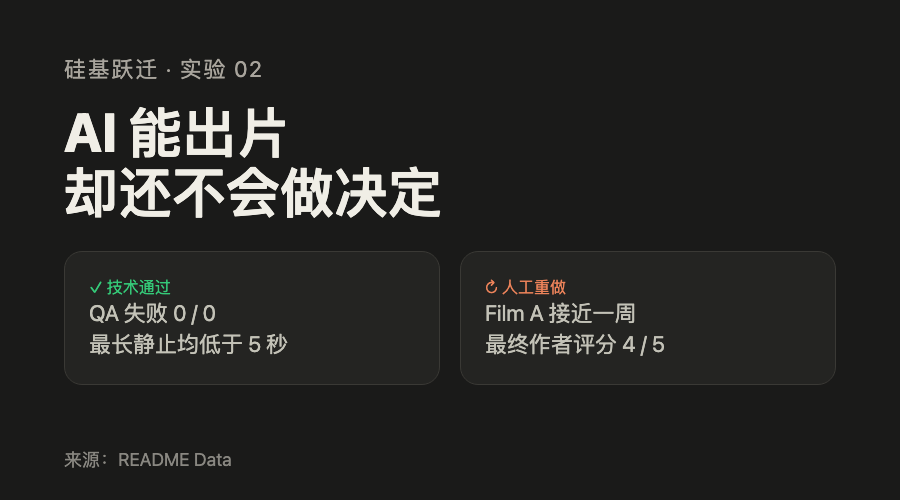

# 微信公众号草稿

## 标题

AI 能出片，却还不会做决定

备选：

1. 137 张图，最后只用了 18 张
2. 两支 AI 动画，真正贵的是判断
3. 片子早就能动，我却改了近一周

## 摘要

同一套流水线生成了一支软件实验动画和一则原创童话。配音、计时和合成已经能自动跑，真正耗时的仍是故事取舍、画面判断和一轮轮否掉重来。

## 正文

这次实验要补上一次内容流水线缺掉的一环：把一段文字故事做成插画动画。要解决的不是“有素材怎么剪”，而是没有分镜、实拍和现成插画时，项目或故事还能不能被讲出来。

上一个实验已经能把一份实验记录整理成网站、GitHub、公众号、小红书和 YouTube 的内容草稿，唯独视频没补上。那支 4 分 24 秒的片子由截图、文字卡和旁白拼成，能播放，却像在念文章，我没有发布。

这次我用同一套最终流程做了两支片子。Film A 是“AI 能否把实验记录做成多平台内容”那次软件实验的动画版，里面有真实截图；Film B 是原创童话《最后一盏灯》，从文字开始，没有现成画面。两支都做出来了，但 Film A 在通过技术检查后，还是被我推翻重做了三次。

**技术检查能确认视频存在，不能确认它讲清了故事。**

**旁白定稿后可以自动化，画面要讲什么仍要人决定。**

### 通过检查，却还没讲成故事

Film A 第一次通过检查时，我本来该收工了。它时长合格，画面也没有连续静止超过 8 秒。可我从头看完，还是说不清它在讲什么。旁白讲的是一次内容实验，画面却只是在转齿轮、飘卡片。文件没坏，故事没讲出来。

### 三次重做，改的不是提示词

我一开始走错了路：先生成背景、人物和道具，抠成透明图层再拼。三版之后，画面还是像贴纸。不同生成的光照和材质对不上，半透明物体也抠不干净。第四版才把顺序翻过来：先按场景生成完整画面，再用代码让画面里的东西动。只有真的需要独立运动的对象，才补一张背景透明的图层。

`editorial-video` 是这次把旁白和场景计划做成镜头的制作工具链。它还在改进，不是已经开放、可以直接安装使用的产品。它之所以默认从完整场景开始，就是因为这次实验已经证明，把所有东西先拆开再拼，往往会把同一空间拆成几张互不相干的图片。

两支片子都通过了基础交付检查，但 Film A 还是被我推翻重做了三次。这个差别很重要：检查只能确认“片子有没有做出来”，不能确认“观众看不看得懂”。

实验两片合计约 19 小时，包含一版作废的 Film B、Film A 的三轮重做、调研、补齐流水线、改旁白和分镜、生成与淘汰素材、渲染和审片。接口费用只有 29.27 元。耗时间的不是等机器，而是判断一个镜头是否真的在替旁白说话。

*封面：两支视频都通过技术检查，真正的差距来自人工打磨。来源为本次实验 Data。*

### 上一次失败，不是因为没有生成出文件

上一个实验也做过视频。最后得到一支 4 分 24 秒的成片，画面由截图、文字卡和静止图拼起来。

文件能播放，但我判定它不能发。它只是在把文章念一遍，没有真正用画面讲故事。

两支片子必须使用同一套最终流水线。这样才能看出它依赖的是现成素材，还是能处理不同题材。

### 第一条路线看起来合理，走了三个版本才被推翻

最初的方案是先定背景，再把人物和道具单独生成，抠成透明图层，最后拼回画面。

它听起来很适合动画。主体能单独动，背景能保持不变，修改一个图层也不用重做整张图。

真正跑起来，三个问题一起出现。

背景和主体来自不同生成，光照和材质对不上，拼起来像贴纸。半透明物体和浅色物体经常抠不出来。更麻烦的是，每次想让画面多一个变化，就要多生成一张图。

我连续做了三个版本，改过提示词、抠图和坐标，却一直在优化执行细节，没停下来问这条路线是不是错了。

*图 1：从“先拆图层再拼装”改为“整场景生成，再用代码让它动”。来源为 README What Worked。*

第四版把顺序反过来：先把配色、材质、光照和运动习惯写成可重复使用的配置，按场景生成完整画面，再用代码处理位移、缩放、生长、翻转和滚动。只有确实需要独立运动的东西，才单独生成背景透明、主体不透的图层，不从完整画面里硬抠边缘。

片 A 最终有 14 个镜头，却只用了 5 张生成图。镜头里的变化主要来自代码，不用每换一个动作就增加一张图片。

### 137 张图里，119 张没有进成片

两支片子总共生成 137 张图。最后用了 18 张，片 A 5 张，片 B 13 张。

图像接口花了 27.5 元，语音花了 1.77 元，总成本 29.27 元。这个数字不高，但它容易掩盖另一笔账：总耗时约 19 小时，失败 21 次，人工介入 37 次。

*图 2：137 张生成图中只有 18 张进入成片，接口成本 29.27 元。来源为 README Data。*

21 次失败指生成、抠图、渲染或校验没有按预期完成的尝试。37 次人工介入里，25 次是决策，10 次是这次靠人提出、下次可写成规则的要求，2 次是纯手工返工。

接口费用主要买的是生成。那 19 小时主要花在判断：这一拍该讲什么，画面是不是在讲同一件事，生成的素材能不能用，要不要推翻重来。

Token 消耗没有记录，所以不写估算值。

### 技术判据很早就通过，内容问题一个也没拦住

片 A 最终 186.46 秒，片 B 76.60 秒。180 秒只是推荐目标，接近即可，不是硬限制。

两支片子的 QA 失败项都是 0。最长静止画面分别是 4.67 秒和 4.00 秒，也都低于 8 秒。

这些判据只能说明清单有效、画面在动。它们衡量不了画面有没有在讲旁白。

片 A 第一版就能过技术检查，但它漏掉了上一个实验的核心结论：哪些内容制作做法有效，哪些无效。有一个镜头的截图和旁白甚至在讲两件不同的事。

我后来给每段旁白补了一条硬要求：必须能说清这个镜头画什么。说不出来，说明那句话还没写完。

### 同一个模型，提示词里真正缺的是内容

有一版图片很粗糙。我先把问题归到模型上，换更强的接口以后，材质确实精细了。

但把提示词拆开看，问题只解决了一半。大部分文字都在说纸张纤维、毛边、配色和光照，真正描述画面内容的只有“一个齿轮”。

一个齿轮放在白底上，再强的模型也只能把空洞画得更清楚。

后来，我把提示词改成五段：具体技法、核心概念、可数的物件、次级细节、角落细节。第一张重写的书桌图一次成功。

这不是多写形容词，而是先把画面里到底有什么想清楚。

### 自动化从旁白定稿以后开始

最终流水线把旁白当作唯一时间来源。先合成语音，再量出每段实际时长，最后换算成每个镜头需要的画面帧数。

改一句旁白以后，不用手工更新 Film A 14 个镜头的时长。配音、字幕、镜头和总时长来自同一份文本和音频。

*图 3：自动化集中在旁白定稿之后，叙事、视觉和审片仍由人决定。来源为 README Conclusion。*

这是作者按完成度和观感给出的主观五分制评分，不是客观质量分。片 A 达到现在的 4/5，日历上跨了接近一周；片 B 半天完成，停在 3/5。这里说的是版本打磨的日历跨度，不与两片合计约 19 小时的实际投入相冲突。

那一周买到的一分，没有任何技术判据看得见。它来自重新想分镜、否掉风格、补具体画面和逐拍审片。

### 这次做了什么，哪些能复制

| 实践 | 是否有效 | 是否可复制 |
| --- | --- | --- |
| 先把风格定成数据，再按场景生成完整画面 | 有效 | 可复制 |
| 一段旁白对应一个画面，镜头时长由配音反推 | 有效 | 可复制 |
| 把可复现的变化交给代码关键帧 | 有效 | 可复制 |
| 独立图层从一开始就生成成不透明实体 | 有效 | 可复制 |
| 把真实截图和校验输出作为画面里的物件 | 有效 | 可复制 |
| 先拆背景和主体，再依赖抠图拼装 | 在本类生成视频的方案中无效 | 不可复制 |
| 靠反复改提示词控制复杂姿态 | 本次无效 | 不可直接复制 |
| 手写逐帧渲染器承担正片 | 无效 | 不可复制 |

### 结论能说到哪里

这次可以确认：对能线性讲述、不依赖真人和实拍的内容，AI 能以较低接口成本生成插画视频。同一套最终流水线也能处理软件实验和原创童话。

样本只有两个。它不能证明所有故事都适合，也不能证明 AI 能自动生成高质量视频。

两支片子已经上传 YouTube，但还没有形成发布数据。这次只能谈做不做得出来，不能谈有没有人看。

这套流水线能把已经想清楚的东西变成视频，但想清楚这件事，它还做不了。

### 现在能看、能拿走什么

两支成片已经公开：Film A 和 Film B 的 YouTube 链接在文末。上一实验留下的 [`content-forge`](https://github.com/siliconleap/silicon-leap-lab/tree/master/.claude/skills/content-forge) 也已经放在公开仓库，可以复制和改造。它会把一个跑完的实验目录整理成网站、GitHub、公众号、小红书和 YouTube 的可审核内容草稿，并带配图源文件和校验步骤。

它不替人完成事实确认、账号权限、最终排版和发布。文章里标为“可复制”的视频做法，是读者可以迁移到自己工具上的原则，不是一套现成可下载的视频生产线。`editorial-video` 则仍是本次实验中持续改进的制作工具链，暂未作为可直接安装、照着跑的公开成品提供。

## 复现

完整记录在公开仓库：[Story to Animated Video 实验目录](https://github.com/siliconleap/silicon-leap-lab/tree/master/experiments/2026-08-story-to-animated-video)。

- Film A：https://youtu.be/oOVnuUOSYBY
- Film B《最后一盏灯》：https://youtu.be/aUFPD-lNm3w

## 配图清单

| # | 文件 | 内容 | 尺寸 | 来源 |
| --- | --- | --- | --- | --- |
| 封面 | `assets/00-cover.html` | 技术通过与人工打磨的反差 | 900 × 500 | README Data |
| 1 | `assets/01-route-change.html` | 两条素材路线对比 | 1080 × 608 | README What Worked |
| 2 | `assets/02-numbers.html` | 137 张生成、18 张采用、29.27 元 | 1080 × 608 | README Data |
| 3 | `assets/03-boundary.html` | 人工判断与自动化的边界 | 1080 × 608 | README Conclusion |

缺口：没有播放数据，不能补传播效果结论。现有两支成片可直接作为文章内视频链接，不需要重演终端过程。

## 发布备注

- 图片渲染：`scripts/render.sh drafts/wechat/assets`
- 发布前在公众号编辑器做手机预览，确认段落、表格和图注。
- 两支 YouTube 视频已发布；文章本身尚未发布。
- 所有用户名、邮箱和绝对路径已从当前工作树及配图文案中移除。
